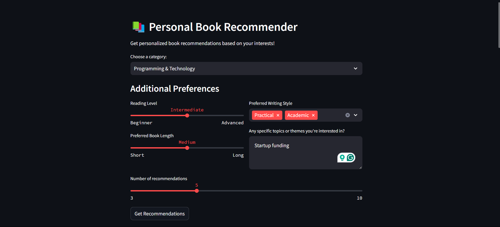
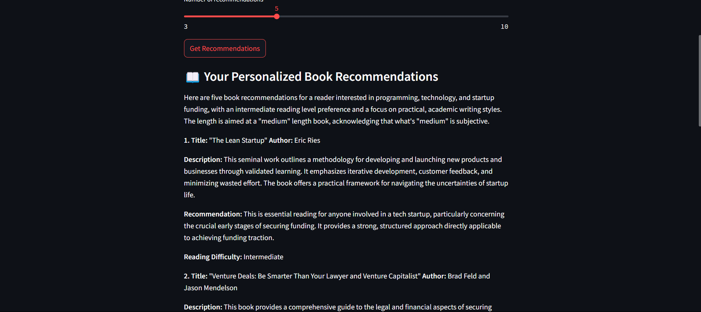

# Book Recommender System 📚

A personalized book recommendation system powered by Google's Gemini AI that provides customized book suggestions based on user preferences and interests.

## Features ✨

- Multi-category book recommendations
- Customizable reading preferences
- Adjustable recommendation count
- Detailed book information including:
  - Title and Author
  - Brief description
  - Personalized recommendation reason
  - Reading difficulty level

## Categories 📑

- Personal Finance & Investment
- Personal Growth & Self-Help
- Science Fiction & Fantasy
- Productivity & Time Management
- Programming & Technology
- Business & Entrepreneurship
- Psychology & Mental Health
- History & Biography
- Philosophy & Critical Thinking
- Health & Wellness

## Prerequisites 🛠️

Before running this application, make sure you have:
- Python 3.7 or higher installed
- Google Gemini API key

## Installation 📥

1. Clone the repository:
```bash
git clone https://github.com/EvansMuthuri/BOOK-RECOMMENDER.git
cd BOOK-RECOMMENDER
```

2. Install required dependencies:
```bash
pip install -r requirements.txt
```

3. Create a `.env` file in the project root directory and add your Google API key:
```env
GOOGLE_API_KEY=your_api_key_here
```

## Usage 🚀

1. Start the Streamlit application:
```bash
streamlit run app.py
```

2. Open your web browser and navigate to the provided local URL (typically http://localhost:8501)

3. Use the interface to:
   - Select a book category
   - Set your reading preferences
   - Specify additional interests
   - Choose the number of recommendations
   - Click "Get Recommendations" to receive personalized suggestions

## Project Structure 📁

```
BOOK-RECOMMENDER/
│
├── app.py    # Main application file
├── requirements.txt       # Project dependencies
├── .env                  # Environment variables (create this)
└── README.md             # Project documentation
```

## Dependencies 📦

Install `requirements.txt` file with these dependencies:
```
streamlit
python-dotenv
google-generativeai
```

(Just run {pip install -r requirements.txt})

## Environment Variables 🔐

The application requires the following environment variables:

- `GOOGLE_API_KEY`: Your Google Gemini API key

## Contributing 🤝

Contributions are welcome! Please feel free to submit a Pull Request.

1. Fork the repository
2. Create your feature branch (`git checkout -b feature/AmazingFeature`)
3. Commit your changes (`git commit -m 'Add some AmazingFeature'`)
4. Push to the branch (`git push origin feature/AmazingFeature`)
5. Open a Pull Request

## Acknowledgments 🙏

- Powered by Google's Gemini AI
- Built with Streamlit
- Inspired by the need for personalized book recommendations

## Support 💬

If you encounter any issues or have questions, please open an issue in the GitHub repository.

## Future Enhancements 🔮

- Save favorite recommendations
- Share recommendations with others
- Add more customization options
- Include book cover images
- Add user ratings and reviews
- Implement a book tracking system


<!--  
  -->